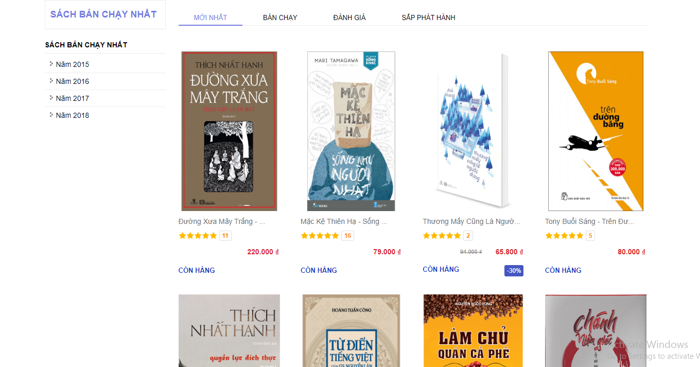

<h1>Trang Web Bán Sách </h1>

Trang có 2 giao diện:

Giao Diện Trang1:

Giao Diện Trang2:

Trang Web gồm có 6 trang: Trang Chủ,Giới Thiệu,Danh Sách,Sách Bán Chạy,Liên Hệ và Fanpage

Giao diện Trang1:

Trang Chủ: 

Giới Thiệu:

Danh Sách:

Trang này có 2 trang:

Sau khi xem xong nhấp chuột vào trở về sẽ về lại trang Giới Thiệu

Sách Bán Chạy

Trang này liên kết với link phuongnambook.com 

Liên Hệ:

Sau khi nhập đầy đủ dữ liệu ,rồi chờ trong giây lát sẽ xuất hiện:

Fanpage:

Sau Khi nhấp vào sẽ dẫn tới FB cá nhân của em

<h2>Cảm Ơn Thầy Đã Xem Bài Của Em</h2>

